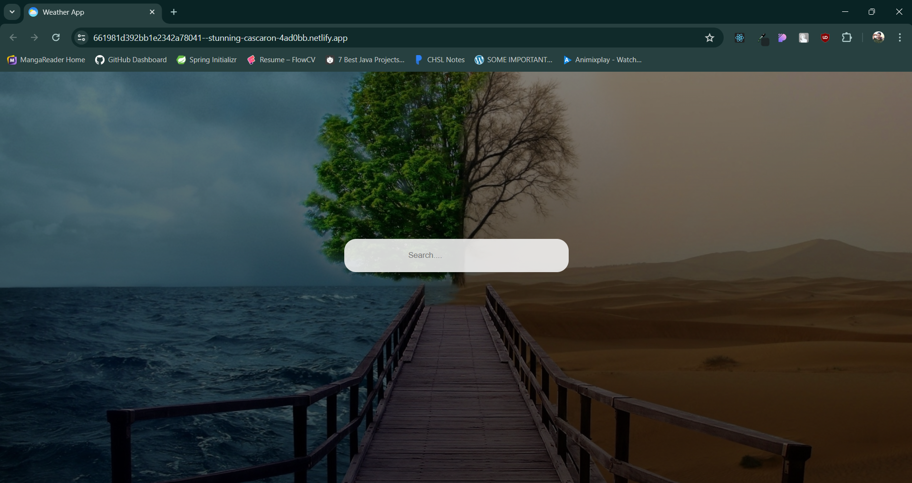

## Weather App

# Description

This Weather App is a simple web application that provides users with current weather information for a specified location. It is built using React.js and integrates with the WeatherAPI to fetch real-time weather data.

# Features

- Current Weather: View the current weather conditions including temperature, humidity, wind speed, and weather description.
- Location-based: Enter the name of a city or location to get weather information for that area.
- Responsive Design: The app is responsive and works well on both desktop and mobile devices.

# Usage

1. Enter the name of a city or location in the search bar.
2. Press the Enter key or click the search button to fetch weather data for the specified location.
3. View the current weather conditions displayed on the screen.

# Technologies Used

- React.js
- Axios (for HTTP requests)
- CSS (for styling)

# Setup

- Clone the repository: (`git clone https://github.com/your-username/weather-app.git`)

- Navigate to the project directory: (`cd weather-app`)

- Install dependencies:(`npm install`)

- Start the development server: (`npm start`)

- Open your browser and visit http://localhost:3000 to view the app.

# API Key

To use the WeatherAPI, you need to sign up for an API key . Once you have obtained your API key, replace YOUR_API_KEY in the Api.jsx file with your actual API key.

# Screenshots

